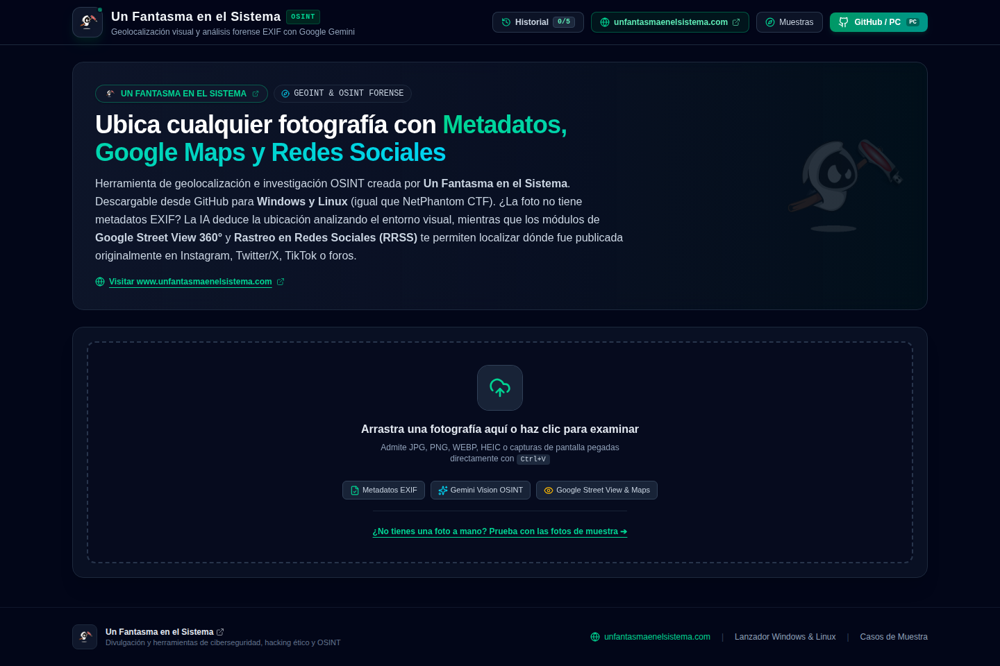
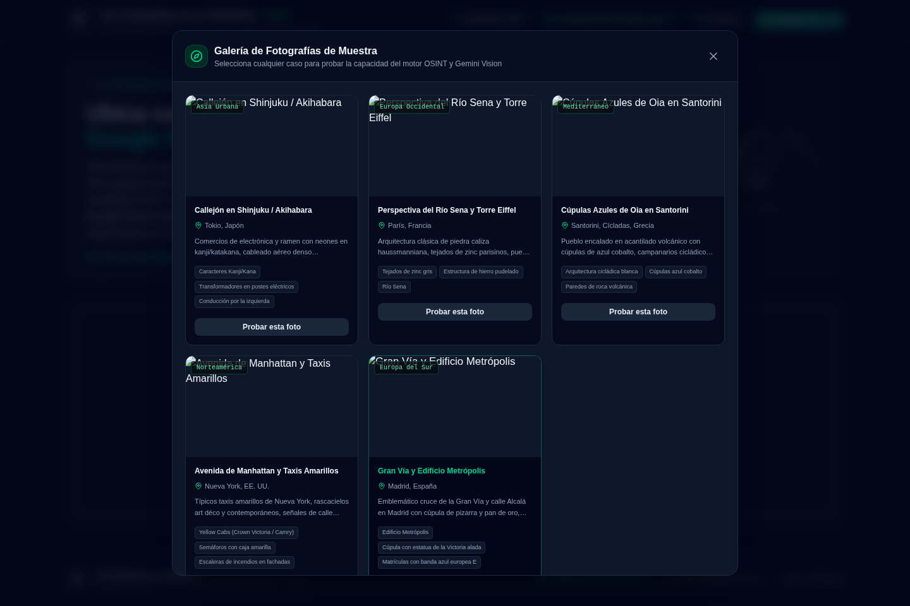
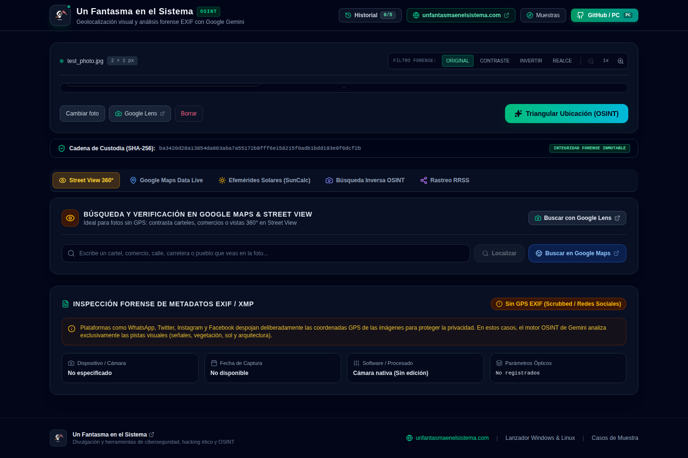

# 🌍 GeoSpecter OSINT - Visual & EXIF Photo Geolocation
### Creado por [Un Fantasma en el Sistema](https://www.unfantasmaenelsistema.com/)

Herramienta de geolocalización e inteligencia geoespacial (GEOINT / OSINT) multiplataforma (Windows y Linux). Permite cargar cualquier fotografía y deducir su ubicación en el mapa combinando **metadatos forenses EXIF** y el poder de **Google Gemini 3.8 Flash Multimodal Vision**.

Sitio Web Oficial: [www.unfantasmaenelsistema.com](https://www.unfantasmaenelsistema.com/)

---

## 🖼️ Capturas de Pantalla

<table>
  <tr>
    <td></td>
    <td></td>
  </tr>
  <tr>
    <td colspan="2"></td>
  </tr>
</table>

---

## ⚡ Características Principales

1. **Doble Motor de Detección:**
   - **Motor 1 (Forense EXIF/XMP):** Si la fotografía fue tomada con un móvil o cámara con GPS activado y no ha sido limpiada por redes sociales, extrae directamente las coordenadas de hardware WGS84, fecha y hora exacta, modelo de cámara y parámetros ópticos.
   - **Motor 2 (Inteligencia Visual Google Gemini):** Si la foto no tiene GPS o para contrastarla, Gemini 3.8 Flash analiza bolardos viales específicos de cada país, tipos de matrículas, arquitectura y tejados, flora y bioma climático, sentido de circulación (izquierda vs derecha), señalética, idioma y ángulo solar con sombras.
2. **Mapa Interactivo Multicapa (Leaflet):**
   - Modo Táctico Oscuro (Esri Dark Gray Canvas).
   - Modo Satélite de Alta Resolución (Esri World Imagery) para examinar azoteas y carreteras reales.
   - Modo Calles y Carreteras (OpenStreetMap).
   - Visualización de radio de incertidumbre y línea de discrepancia entre EXIF e IA.
   - Acceso directo a **Google Maps**, **Google Street View** y **Google Earth 3D**.
3. **Visor de Imágenes con Filtros Forenses:**
   - Filtro de Alto Contraste (para leer letreros o matrículas lejanas).
   - Inversión de Color (para textos tenues o grafitis).
   - Realce de Bordes y zoom óptico hasta 3x.
4. **Cronolocalización (hora y estación estimadas):**
   - Deduce la ventana horaria por la inclinación y proporción de las sombras.
   - Deduce la estación del año por el estado fenológico de la vegetación (hojas, nieve, floración).
   - Cruza ambos vectores en un dictamen forense conjunto.
5. **Rastreo OSINT en Redes Sociales:**
   - Genera términos de búsqueda óptimos para X, Instagram y Reddit.
   - Lanza un escaneo en vivo contra fuentes abiertas desde la propia app.
   - Atajos directos a Yandex, Google Lens, Bing Visual Search y TinEye para búsqueda inversa de imagen.
6. **Dossier e Informes Exportables:**
   - Informe pericial en **PDF** con cadena de custodia, hash SHA-256, pistas visuales y enlaces de auditoría.
   - Exportación en **GeoJSON** y **KML** (compatible con Google Earth y cualquier SIG).
   - Historial local de las últimas 5 investigaciones (guardado en el navegador, no sale de tu equipo).
7. **Listo para GitHub & Multiplataforma (Windows y Linux):**
   - Incluye lanzadores automáticos de 1 clic: `run.bat` para Windows y `run.sh` para Linux/macOS.

---

## 🧭 Cómo se usa

1. **Carga una foto**: arrástrala a la zona de subida, pégala con `Ctrl+V` o elige una de la galería de muestras incluida.
2. **GeoSpecter analiza la imagen** en dos pasadas: primero intenta leer GPS nativo del EXIF; si no hay, o para contrastarlo, envía la imagen a Gemini junto con las pistas visuales del entorno.
3. **Revisa el dictamen**: ubicación, radio de incertidumbre, cronolocalización (hora/estación) y cada pista visual individual con su nivel de impacto (`CRITICAL` / `STRONG` / `SUPPORTING`).
4. **Verifica en el mapa**: cambia entre capa táctica, satélite o calles, y salta directo a Google Street View o Google Earth 3D sobre el punto estimado.
5. **Lanza el rastreo social** (opcional) para buscar dónde se publicó la imagen originalmente, usando los términos clave sugeridos.
6. **Exporta el caso**: PDF pericial para informe, o GeoJSON/KML si vas a cruzar el punto con otras herramientas SIG/OSINT.

---

## 🚀 Instalación y Puesta en Marcha

### Prerrequisitos
- **Node.js** (v18 o superior) instalado en el equipo.
- Una clave API de Google Gemini (puedes obtenerla gratis en [Google AI Studio](https://aistudio.google.com/)).

---

### En Windows (1 Clic)
1. Clona el repositorio:
   ```cmd
   git clone https://github.com/unfantasmaenelsistema/ghost-image-locator.git
   cd ghost-image-locator
   ```
2. Haz doble clic en el archivo **`run.bat`** (o ejecútalo desde CMD/PowerShell).
3. El script comprobará dependencias, creará el `.env` y abrirá la aplicación en tu navegador en `http://localhost:3000`.

---

### En Linux / macOS
1. Clona el repositorio:
   ```bash
   git clone https://github.com/unfantasmaenelsistema/ghost-image-locator.git
   cd ghost-image-locator
   ```
2. Da permisos de ejecución al script y lánzalo:
   ```bash
   chmod +x run.sh
   ./run.sh
   ```
3. El script instalará las dependencias y abrirá la aplicación en `http://localhost:3000`.

---

### Configuración de la API Key (.env)
Crea o edita el archivo `.env` en la raíz del proyecto:
```env
GEMINI_API_KEY="AIzaSy..."
PORT=3000
```
`PORT` es opcional (por defecto `3000`). Las comillas en `GEMINI_API_KEY` son opcionales, `dotenv` las retira automáticamente.

> ⚠️ **Importante:** si editas `.env` con el servidor ya arrancado, reinícialo (`Ctrl+C` y `npm start`). La clave solo se lee una vez al arrancar; dejarlo corriendo con el valor antiguo es la causa más común de `API key not valid`.

---

## 🩺 Solución de Problemas

**`npm install` falla con `ERESOLVE` / conflicto de `esbuild`**
El proyecto fija versiones de dependencias que deben mantenerse compatibles entre sí (p. ej. `esbuild` con la versión de `vite`). Si clonas una versión antigua y ves este error, actualiza `esbuild` en `package.json` a la misma franja que exige `vite` (`^0.27.0` o superior) y vuelve a instalar.

**El mapa en modo "Táctico" sale negro con marcas de agua "API KEY REQUIRED"**
Ocurre si la capa oscura apunta a un endpoint de teselas de CARTO que ya no sirve tiles gratis sin registro. Esta versión usa el basemap `World_Dark_Gray_Base` de Esri (gratuito, sin API key) para evitarlo; si lo ves, asegúrate de estar en la última versión de `main`.

**Error `API key not valid. Please pass a valid API key.`**
Casi siempre es que el servidor sigue corriendo con la clave antigua. Para el proceso (`Ctrl+C`) y vuelve a lanzar `npm start` (o `run.bat` / `run.sh`) después de guardar el `.env`.

**El puerto 3000 ya está en uso**
Cambia `PORT` en el `.env` a otro valor libre (p. ej. `3001`) y reinicia el servidor.

---

## 🛠️ Tecnologías Empleadas
- **Frontend:** React 19, TypeScript, Tailwind CSS, Leaflet, Lucide Icons, Motion.
- **Backend:** Node.js, Express, tsx.
- **IA y Visión Espacial:** `@google/genai` (Gemini 3.8 Flash).
- **Filtros Forenses EXIF:** `exifr`.
- **Mapas y Cartografía:** Leaflet, Esri (satélite y basemap táctico), OpenStreetMap.
- **Informes:** `jspdf` (dossier pericial en PDF), exportación nativa a GeoJSON y KML.

---

## 📄 Licencia
Distribuido bajo licencia MIT. Desarrollado con fines de investigación OSINT, formativos y educativos.
